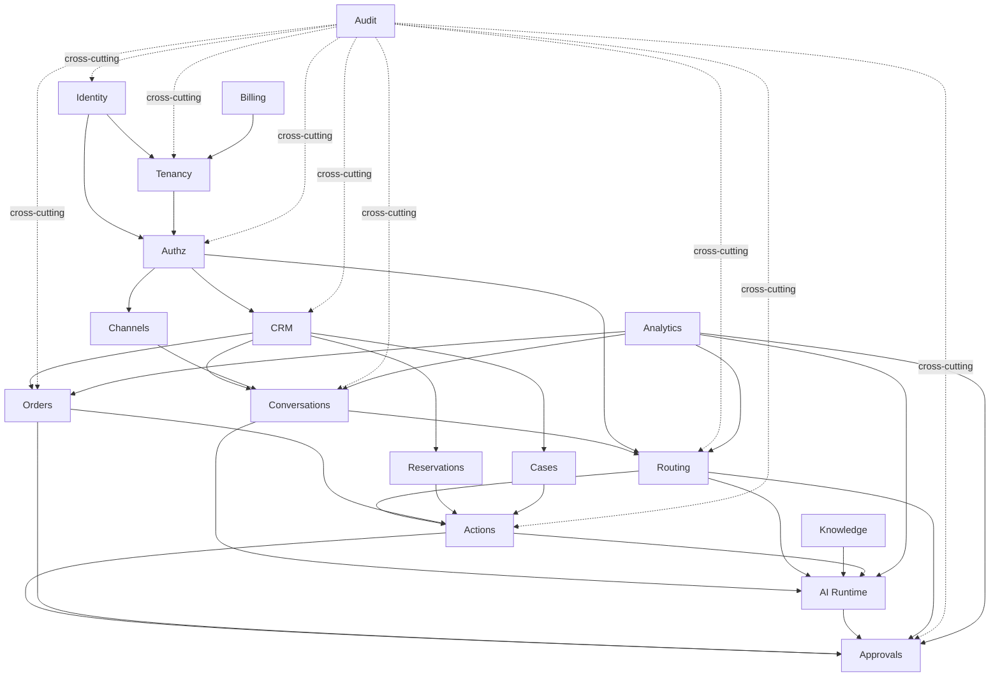

# Dependency Rules

## Dependency DAG

## Rules

### 1. Foundation Domains Are Upstream Only

**Identity**, **Tenancy**, and **Authz** are foundation domains.
- Other modules CAN depend on them.
- They MUST NOT depend on operational domains.

### 2. CRM Is Shared Read

**CRM** can be used by Conversations, Orders, Actions, and AI Runtime.
- CRM MUST NOT own those flows.
- Cross-domain reads are allowed.
- Cross-domain writes are NOT allowed.

### 3. Conversations ≠ Routing

**Conversations** owns message persistence.
**Routing** owns ownership and handoff.
- Do NOT mix these two responsibilities.
- A routing change does not modify message content.
- A message persistence change does not modify ownership.

### 4. AI Runtime Uses Service Interfaces

**AI Runtime** may call Conversations, Routing, Knowledge, Actions, and CRM through service interfaces.
- AI Runtime MUST NOT bypass Authz, Policy, Approval, or Ownership rules.
- Every AI action goes through the action engine, not directly to domain tables.

### 5. Actions Orchestrate, Domains Execute

**Actions** may call domain services: Orders, Reservations, CRM, Routing, Cases.
- Actions MUST NOT implement domain business logic internally.
- Actions dispatch to domain handlers; they don't duplicate domain logic.

### 6. Orders Owns Order Lifecycle

**Orders** owns the order lifecycle.
- Conversations may reference orders but MUST NOT implement order rules.
- Order state transitions happen through Orders RPCs only.

### 7. Approvals Are Standalone

**Approvals** can be requested by Actions, Orders, AI Runtime, or Routing.
- Approvals MUST NOT directly mutate domain records.
- Approvals gate domain operations; the domain service executes after approval.

### 8. Audit Is Cross-Cutting

**Audit** is the only truly cross-cutting domain.
- Every sensitive domain MUST write audit events via `log_audit()`.
- Audit does NOT read or modify business logic data.
- Audit is append-only.

### 9. Billing & Analytics Are Consumers

**Billing** and **Analytics** should consume events or read through query services.
- They MUST NOT become hidden owners of business logic.
- They are downstream-only.

## Anti-Patterns

| Anti-Pattern | Why It's Wrong | Correct Approach |
|---|---|---|
| Conversation owns order | Domain boundary violation | Order domain owns order logic |
| Action owns domain logic | Actions orchestrate, not execute | Action dispatches to domain handler |
| UI owns permission truth | Security bypass risk | Authz is server-side truth |
| AI bypasses policy | Safety violation | AI goes through policy evaluation |
| Mixed Level A/B integrations | Payment isolation violation | Separate provider scopes |
| Restaurant lock-in | Extensibility blocker | Use business_type + config pattern |
| Sensitive changes without audit | Compliance violation | Always call log_audit() |
| God module | Maintainability killer | One domain, one responsibility |
| Hidden ownership state | State confusion | Routing domain tracks ownership explicitly |
